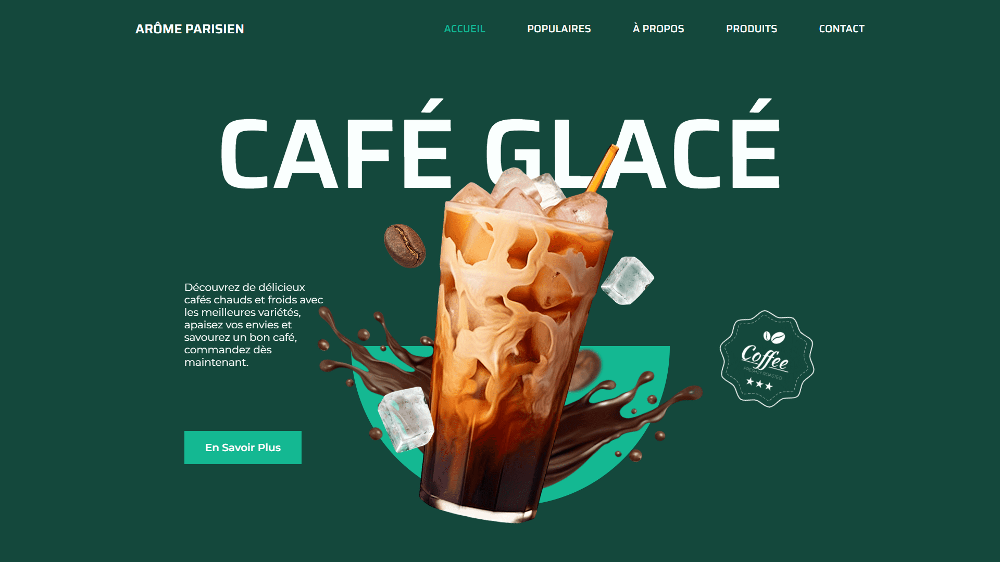

<div align="center">  
    <a href="https://coffee-shop-3-vm.netlify.app/" target="_blank">  
        
    </a>
    </br>  
    </br>  
  <h3 align="center">☕ Arôme Parisien &nbsp; — &nbsp; Café Moderne & Glacé</h3>  
</div>

## <br /> 📌 Sommaire

&nbsp;&nbsp;&nbsp; 🎨 &nbsp; [**Introduction**](#introduction)<br />
&nbsp;&nbsp;&nbsp; 🛠️ &nbsp; [**Technologies**](#technologies)<br />
&nbsp;&nbsp;&nbsp; 🎯 &nbsp; [**Fonctionnalités**](#fonctionnalités)<br />
&nbsp;&nbsp;&nbsp; 🚀 &nbsp; [**Installation**](#installation)<br />

## <br /> <a name="introduction">🎨 Introduction</a>

Arôme Parisien est une landing page énergique et stylisée pour une marque de café moderne spécialisée dans les boissons glacées. Combinant animations
ScrollReveal, carousel Swiper, visuels immersifs et interface responsive, le projet offre une expérience dynamique et chaleureuse. Parfait pour un coffee shop urbain ou une marque de boissons premium.

## <br /> <a name="technologies">🛠️ Technologies</a>

- HTML5 sémantique et structuration claire
- CSS3 moderne avec variables, media queries et animations
- JavaScript ES6 clair et modulaire
- [Swiper.js](https://swiperjs.com/) pour le carrousel des produits populaires
- [ScrollReveal](https://scrollrevealjs.org/) pour des animations au scroll
- [Remix Icons](https://remixicon.com/) pour des icônes vectorielles modernes
- Responsive Design pensé en mobile-first

## <br /> <a name="fonctionnalités">🎯 Fonctionnalités</a>

- Hero animé avec éléments flottants
- Section Populaires avec slider interactif
- Section À Propos avec images animées
- Catalogue produit détaillé avec prix et boutons d’achat
- Menu mobile responsive avec animation slide
- Section Contact complète avec réseaux sociaux, carte, horaires
- Pied de page avec moyens de paiement, newsletter et mentions
- Bouton scroll-up animé
- ScrollReveal customisé pour chaque bloc
- Palette verte foncée élégante et typographie soignée

## <br /> <a name="installation">🚀 Installation</a>

### ✅ Prérequis

- [Google Chrome](https://www.google.com/) &nbsp;—&nbsp; Navigateur moderne
- [Visual Studio Code](https://code.visualstudio.com/) &nbsp;—&nbsp; Éditeur de code
- [Live Server](https://marketplace.visualstudio.com/items?itemName=ritwickdey.LiveServer) &nbsp;—&nbsp; Extension VS Code

### 📥 Cloner le projet

```bash
git clone git@github.com:ValentinMadiot/coffee-shop-3_ui
cd coffee-shop-3_ui
```

### ▶️ Lancer le projet

Il suffit d’ouvrir le fichier `index.html` dans un navigateur, ou d’utiliser l’extension **Live Server** sur VS Code pour un aperçu dynamique.
